# Flashback

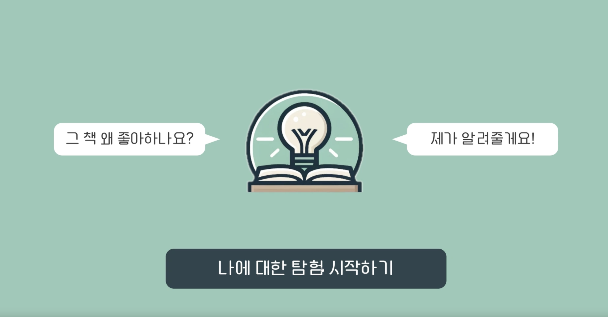

> **이화여대 사이버보안학과 졸업프로젝트 진주선영조** <br/> 
**개발기간 : 2023.9.2 ~ 2024.6.28**


## Development Team 👥
- 오서영 : 백엔드
- 배유선 : 백엔드
- 배윤주 : 프론트엔드
- 최유진 : AI

## Project Introduction 📁
- 질문을 통해 책의 선호 문장의 이유를 정의해 자신을 더 깊이 이해하도록 도와주는 서비스

## Main Function 📦

- 책의 기본적 정보와 마음에 든 문장을 등록합니다. 등록된 문장을 통해 사용자가 선호의 감정을 책의 어떤 부분에서 느꼈는지를 파악하기 위해 채팅하기를 선택합니다.

- 그러면 사용자가 등록한 책과 문장을 고려해 선호 이유를 구체화할 수 있는 질문을 생성합니다. 질문은 chat gpt api를 사용해 생성합니다. (프롬프트 이미지를 가리키며)저희는 프롬프트를 생성할 때 최대한 요구사항을 구체적으로 작성했습니다. 이렇게 생성된 질문들은 사용자에게 chat bot의 형태로 제공되고, 사용자는 질문에 답변을 합니다.

- 다음 단계에서 질문과 사용자의 답변을 요약해 문장 선호 이유를 정의합니다.

- 마지막 단계에서는 정의된 선호 이유를 워드 클라우드를 통해 시각화 하여 사용자에게 제공합니다.

<div align="center">
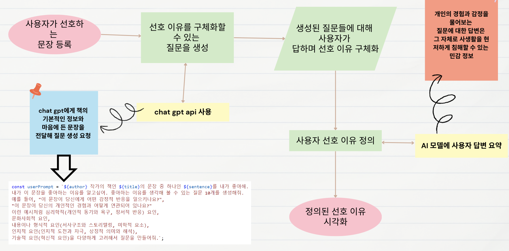

</div>


## Page Configuration 📺
| 시작 페이지  |  로딩 페이지   |
| :-------------------------------------------: | :------------: |
|  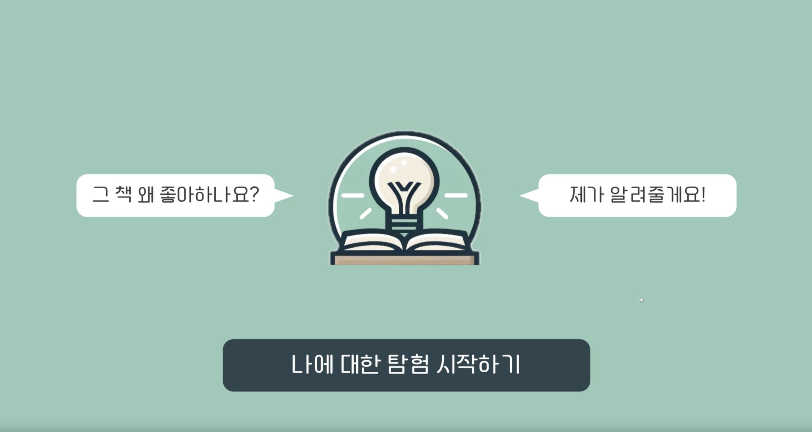 |  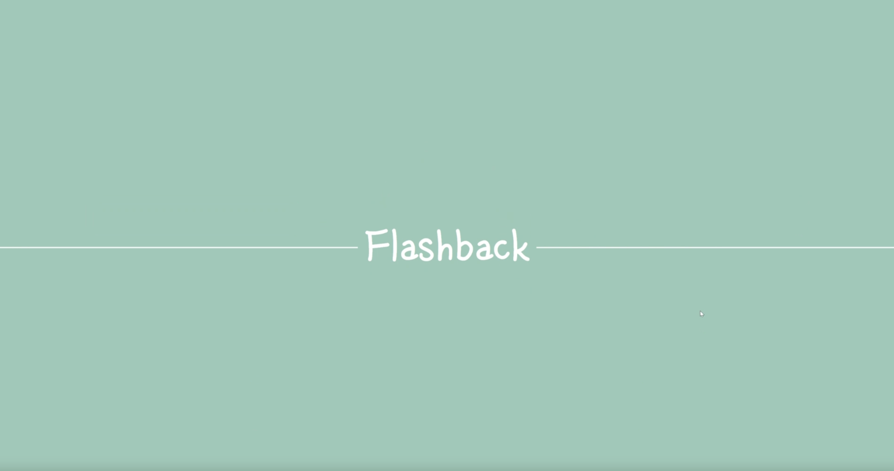|  
| 로그인 페이지   |  메인 페이지   |  
| 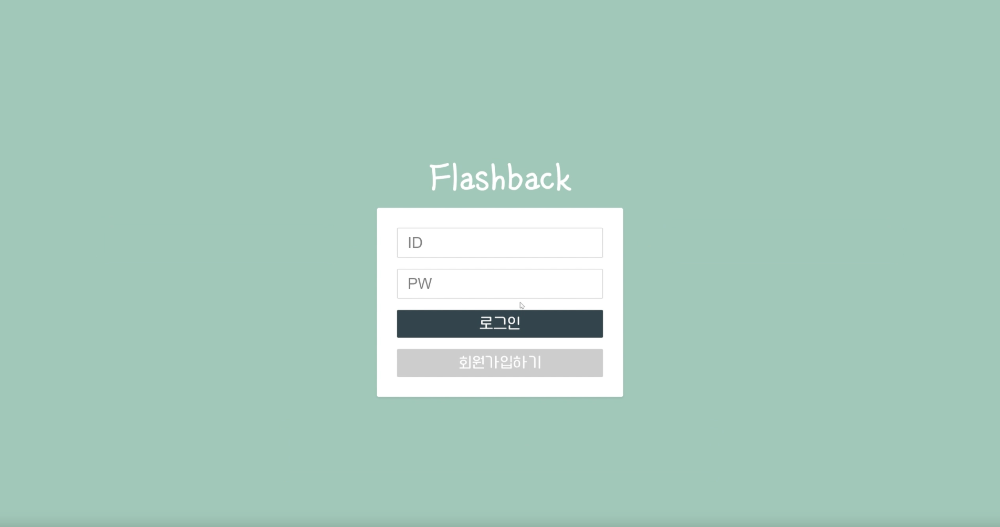   |  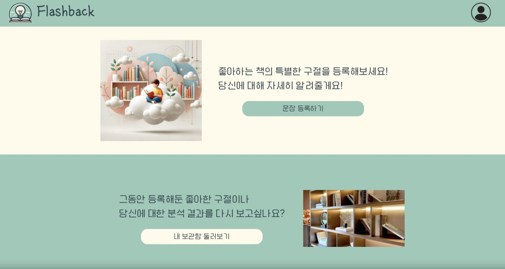     |
| 문장 등록 페이지  |  문장 보관함 페이지   |
|  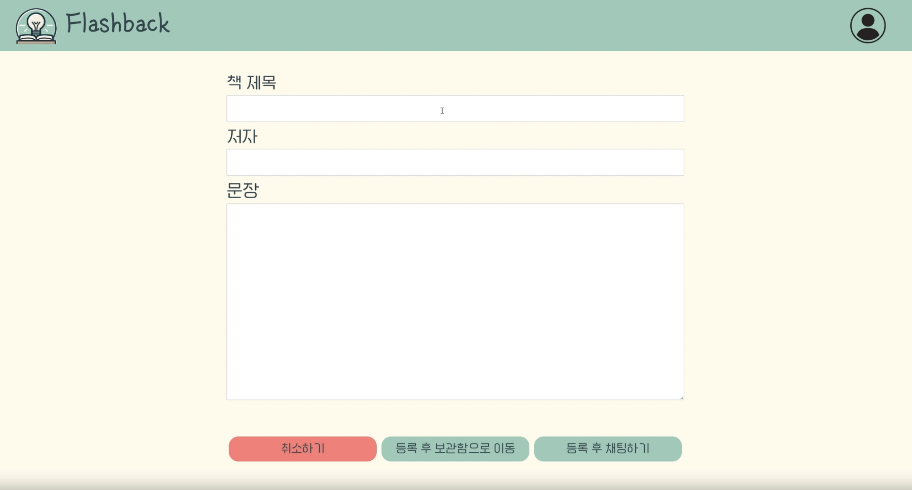 |  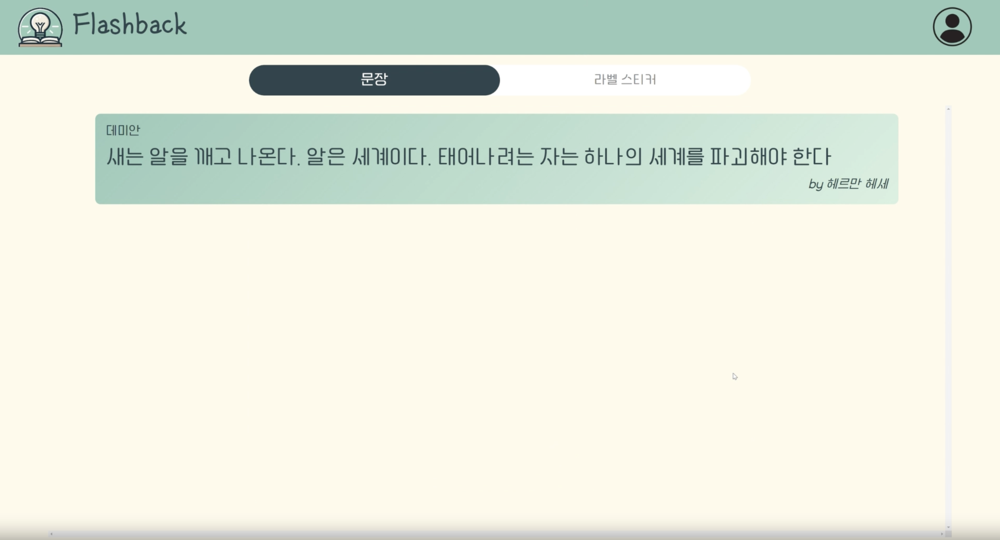|  
| 챗봇 페이지  |  결과 페이지   |
|  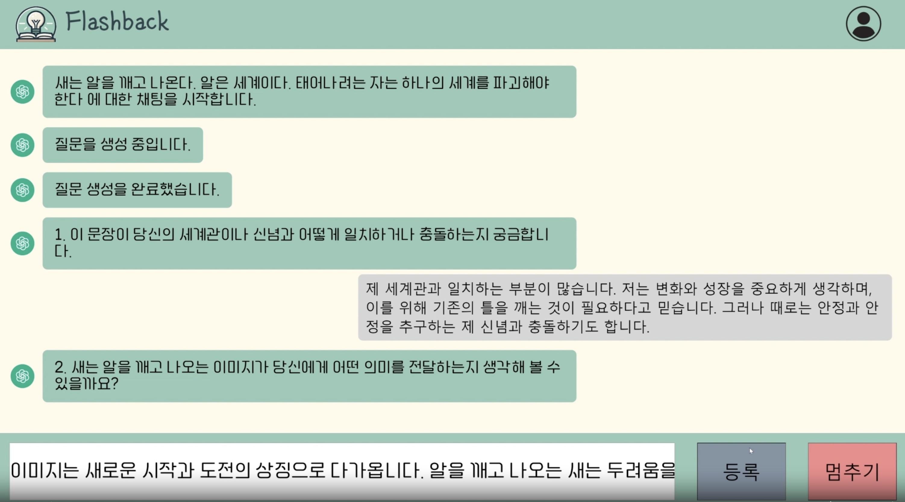 |  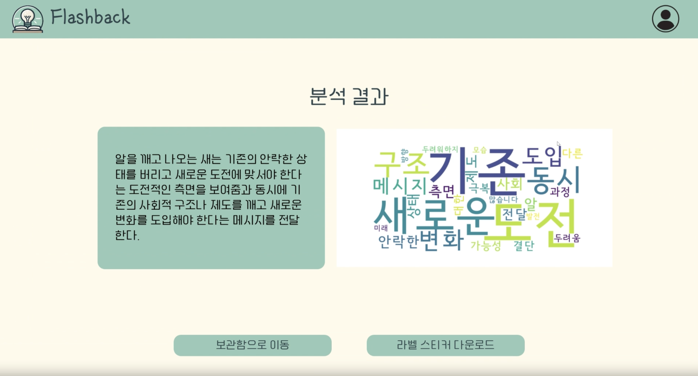| 
| 라벨 스티커 페이지  |     |
|  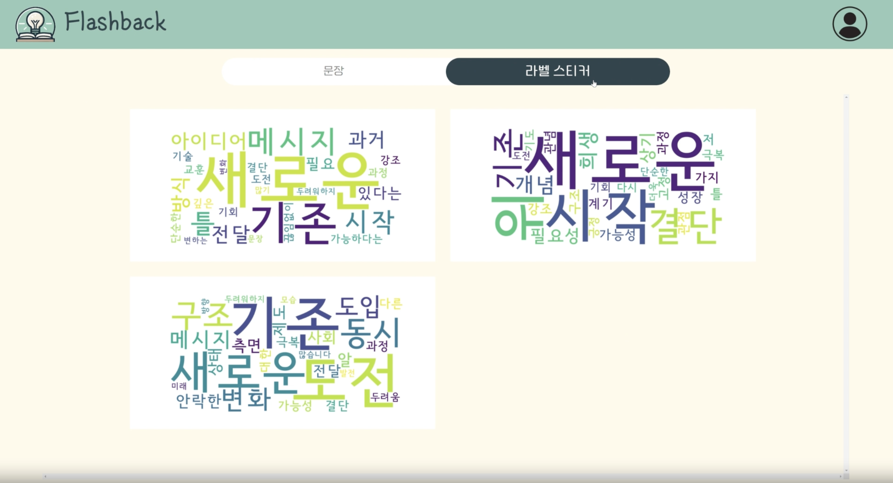 |  


## Stacks 🐈

<div align="center">
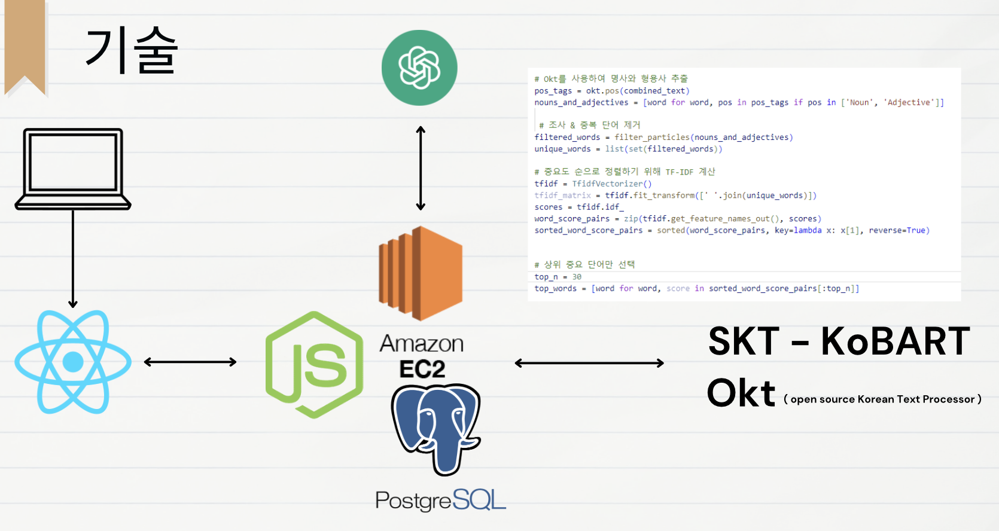

</div>


### Environment


             

### Config
        

### Development
> **Front-end** </br></br>


</br>

> **Back-end** </br></br>


### Communication


## Start Guide 📌
```
git clone https://github.com/SeoyoungOhMe/Flashback.git
```
- 의존성 모듈 설치
```
npm install express ejs body-parser pg express-session bcrypt jsonwebtoken
```
- 시작 
npm start로 시작!
